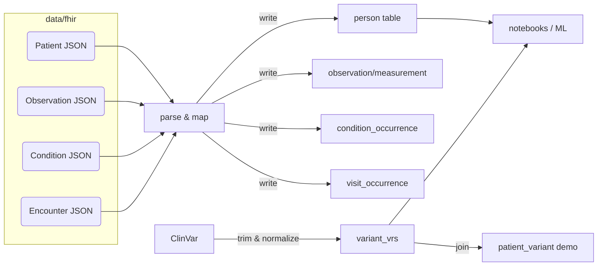

# ETL details

This page shows a more detailed view of the FHIR → OMOP-like ETL steps used in this repo.

Notes
- The ETL is implemented in `epic_etl/run_etl.py` and writes to `data/epic_synth.db`.
- The ClinVar normalization is a prototype in `epic_etl/clinvar.py` (sha256-based VRS id). If you need GA4GH-compliant canonicalization, consider integrating `ga4gh-vrs` libraries.
